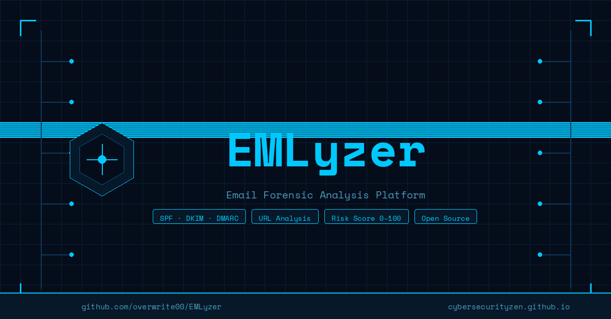

# 🔍 EMLyzer



**Piattaforma open-source di analisi delle email** per identificare spam, phishing e contenuti malevoli.

EMLyzer permette di analizzare un'email sospetta caricando il file `.eml` o `.msg`, oppure incollando direttamente il sorgente, e ottiene in pochi secondi un **rapporto completo** con punteggio di rischio spiegabile, analisi degli header, del corpo, degli URL, degli allegati e dei servizi di reputazione.

> **Non è necessaria nessuna API key per iniziare.** Le integrazioni con servizi esterni (AbuseIPDB, VirusTotal, ecc.) sono opzionali e configurabili successivamente.

---

## 📋 Indice della documentazione

| File | Contenuto |
|---|---|
| [docs/REQUISITI.md](docs/REQUISITI.md) | Requisiti di sistema, software necessario |
| [docs/INSTALLAZIONE.md](docs/INSTALLAZIONE.md) | Guida installazione passo-passo (Windows e Linux) |
| [docs/CONFIGURAZIONE.md](docs/CONFIGURAZIONE.md) | Configurazione `.env`, API key servizi di reputazione |
| [docs/UTILIZZO.md](docs/UTILIZZO.md) | Come usare l'applicazione, tutte le funzioni |
| [docs/API.md](docs/API.md) | Riferimento API REST (per sviluppatori) |

---

## ⚡ Avvio rapido

### Windows
1. Installa **Python 3.13** da [python.org](https://www.python.org/downloads/)
2. Scarica e decomprimi il progetto
3. Fai doppio clic su **`start.bat`**
4. Apri il browser su **http://localhost:8000**

### Linux / macOS
```bash
git clone https://github.com/tuo-utente/EMLyzer.git
cd EMLyzer
chmod +x start.sh
./start.sh
```
Poi apri **http://localhost:8000**

> La prima esecuzione scarica le dipendenze Python (~2 minuti). Le esecuzioni successive partono in pochi secondi.

---

## 🖼️ Cosa fa

```
Email (.eml / .msg / testo incollato)
         │
         ▼
┌─────────────────────────────────────────────┐
│  Analisi Header     → SPF/DKIM/DMARC,       │
│                       mismatch identità,    │
│                       percorso SMTP         │
│                                             │
│  Analisi Body       → pattern phishing,     │
│                       link offuscati,       │
│                       HTML nascosto, NLP    │
│                                             │
│  Analisi URL        → IP diretti,           │
│                       shortener, Punycode,  │
│                       età dominio (WHOIS)   │
│                                             │
│  Analisi Allegati   → hash, macro VBA,      │
│                       JavaScript in PDF     │
│                                             │
│  Reputazione        → AbuseIPDB, VirusTotal,│
│                       OpenPhish, PhishTank, │
│                       Shodan, URLhaus,      │
│                       ThreatFox, crt.sh,   │
│                       MalwareBazaar,       │
│                       CIRCL Passive DNS,   │
│                       GreyNoise, URLScan,  │
│                       Pulsedive, CriminalIP│
│                       SecurityTrails,      │
│                       Hybrid Analysis      │
└─────────────────────────────────────────────┘
         │
         ▼
  Risk Score 0–100 + Report .docx editabile
```

---

## 🔧 Versione

**v0.13.0** — Python 3.11–3.13, 110 test automatici, Windows + Linux

---

## 📄 Licenza

Distribuito sotto licenza **MIT**. Consulta il file [LICENSE](LICENSE) per i dettagli.